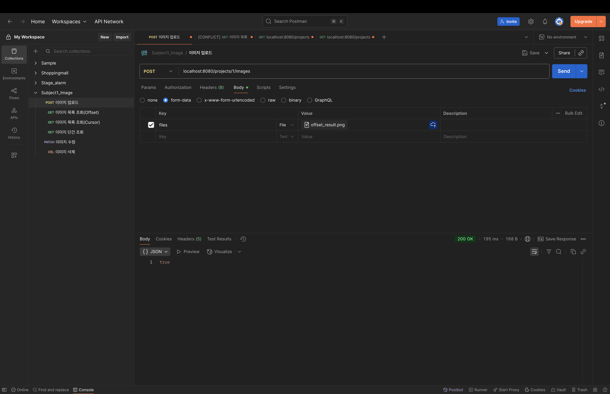

## Subject1_Images 프로젝트

### 구현 기능

- CRUD API 구현 완료.

| **기능** | **메서드** | **엔드포인트** | **설명** |
| --- | --- | --- | --- |
| 이미지 업로드 | POST | /projects/{projectId}/images | 멀티파트 업로드(N장 가능),<br/>중복 업로드 방지(해시 기반 또는 락) |
| 이미지 목록 조회 | GET | /projects/{projectId}/images | Offset / Cursor 페이징 지원,<br/>상태/태그 필터 |
| 이미지 단건 조회 | GET | /images/{id} | 메타데이터 + presigned URL 반환 |
| 이미지 수정 | PATCH | /images/{id} | 태그, 메모, 상태 변경 |
| 이미지 삭제 | DELETE | /images/{id} | 소프트 삭제 (softDelete=true) 처리 |
- 페이징 성능
    - Offset / Cursor 방식 모두 구현 완료.
    - 10,000건 기준 성능 비교 리포트 작성 완료.
    - GET / images Cursor 모드 p95 < 120ms
- 업로드 성능
    - 단건 업로드 p95 < 300ms.
        

    - 동시 50요청 중복 업로드 → 중복 생성 0건.

      

- 썸네일 파이프라인
    - 업로드 후 비동기 썸네일 생성 완료.
    - 실패 시 지수 백오프(최대 3회) 구현 완료: 1초 → 2초 → 4초 순으로 백오프 실행.
    - 상태 전이: PROCESSING → READY/FAILED 구현 완료.
- 저장소 설계
    - 원본과 썸네일 파일은 MinIO에 저장 구현 완료.
    - DB에는 메타데이터만 보관 완료.
    - 인덱스 설계 및 적용 완료.

        ```sql
        CREATE INDEX idx_image_project_id_image_id ON Image (project_id, image_id);
        ```

- 캐시 기능
    - Redis Cloud로 캐시 기능 구현 완료.
- 재현 가능한 시드 데이터 구현 완료.
  - [DataSeeder.java](./src/main/java/com/subject1/images/config/DataSeeder.java)

### 사용 기술

- Java 21
- Spring Boot 3.5.5
- MinIO version ```minio/minio:RELEASE.2025-04-22T22-12-26Z```
- Thumbnailator
- Redis Cloud
- SQLite
- Querydsl
- Spring Retry
- dataFaker
- JMeter

### 설치 및 실행 방법

- Homebrew 설치 확인 (MacOS 또는 Linux 운영체제)
- Docker hub 설치 확인
- git clone https://github.com/fish-minkyu/image_subject1.git
- JMeter 설치

    ```bash
    // 설치 명령어
    brew search jmeter
    brew install jmeter
    
    // 실행 명령어
    jmeter
    ```


1. MinIO  version```minio/minio:RELEASE.2025-04-22T22-12-26Z``` 다운로드 명령어

```bash
# 1. Docker hub 로그인
docker login -u ${유저이름}

# 2. minio/minio:RELEASE.2025-04-22T22-12-26Z pull
docker pull minio/minio:RELEASE.2025-04-22T22-12-26Z

# 3. minio 이미지 실행
# ID: tester
# PW: t12345678
# URL localhost:4381
docker run --user root -d --name minio -e "MINIO_ROOT_USER=tester" -e "MINIO_ROOT_PASSWORD=t12345678" -p 4380:9000 -p 4381:9001 -v minio_data:/data minio/minio:RELEASE.2025-04-22T22-12-26Z server /data --console-address ":9001"
```

2. MinIO 로그인


3. 터미널로 이동하여 ```jmeter``` 명령어 실행
    ```bash
    jmeter
    ```

### API 명세서 링크 (Postman)
https://lunar-meadow-994802-7901.postman.co/workspace/My-Workspace~c69748bb-1997-44ae-8afd-c39a5a82815b/collection/28378931-0360c126-6ac7-41e1-8c0f-44fc82ed1cdd


### 성능 테스트 스크립트 및 실행방법
[READTEST.md](READTEST.md)